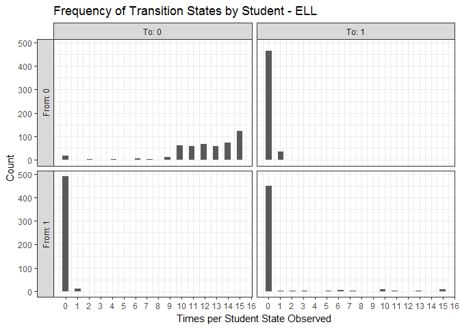
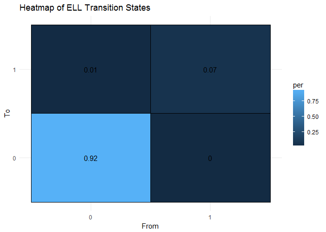

<!-- README.md is generated from README.Rmd. Please edit that file -->
OpenSDP Data
============

A project to generate realistic synthetic unit-level longitudinal education data.

Design Goals
------------

1.  Generate synthetic education data that is realistic for use by analysts across the education sector. Realistic means messy, and reflective of the general pattern of relationships found in the U.S. education sector.
2.  Synthetic data should be able to be generated on-demand and responsive to inputs from the user. These inputs should allow the user to configure the process to produce data that resembles the patterns of data in their agency.
3.  The package should be modular and extendable allowing new data topics to be generated as needed so synthetic data coverage can grow.

Get Started
===========

To use `OpenSDP.data`, follow the instructions below:

Install Package
---------------

The development version of the package is able to be installed using the `install_github()`. To use this command you will need to install the `devtools` package.

``` r
devtools::install_github("strategicdataproject/OpenSDP.data")
```

Make some data
--------------

Load the package

``` r
library(OpenSDP.data)
#> Loading required package: dplyr
#> 
#> Attaching package: 'dplyr'
#> The following objects are masked from 'package:stats':
#> 
#>     filter, lag
#> The following objects are masked from 'package:base':
#> 
#>     intersect, setdiff, setequal, union
#> Loading required package: lme4
#> Loading required package: Matrix
```

``` r
out <- simpop(nstu = 500, seed = 213, control = sim_control(nschls = 3))
#> Preparing student identities for 500 students...
#> Creating annual enrollment for 500 students...
#> Assigning 500 students to initial FRPL, IEP, and ELL status
#> Assigning initial grade levels...
#> Organizing status variables for you...
#> Assigning 500 students longitudinal status trajectories...
#> Sorting your records
#> Cleaning up...
#> Creating 3 schools for you...
#> Assigning 6946 student-school enrollment spells...
#> Joining, by = "sid"
#> Simulating assessment table... be patient...
#> Joining, by = "sid"
#> Joining, by = c("sid", "schid", "year")
#> Simulating high school outcomes... be patient...
#> Simulating annual high school outcomes... be patient...
#> Joining, by = c("sid", "yr")
#> Joining, by = c("sid", "yr")
#> Joining, by = c("sid", "yr")
#> Joining, by = "sid"
#> Joining, by = c("sid", "yr_seq")
#> Simulating postsecondary outcomes... be patient...
#> Joining, by = "opeid"
#> Success! Returning you student and student-year data in a list.
head(out$demog_master %>% arrange(sid) %>% select(1:4))
#>   sid    Sex  Birthdate                         Race
#> 1 001   Male 2000-01-30                        White
#> 2 002   Male 1998-01-25                        White
#> 3 003 Female 2000-10-22    Black or African American
#> 4 004 Female 2003-10-05                        White
#> 5 005 Female 2001-05-27 Hispanic or Latino Ethnicity
#> 6 006 Female 1998-12-16                        White
head(out$stu_year, 10)
#> Source: local data frame [10 x 17]
#> Groups: sid [10]
#> 
#>       sid  year   age grade  frpl   ell   iep gifted grade_advance
#>    <fctr> <dbl> <dbl> <chr> <chr> <chr> <chr>  <chr>         <chr>
#> 1     002  2002     5    KG     0     0     0      0          <NA>
#> 2     009  2002     6     1     1     0     0      1          <NA>
#> 3     014  2002     5    KG     1     0     0      0          <NA>
#> 4     017  2002     4    PK     0     0     0      0          <NA>
#> 5     023  2002     5    KG     0     0     0      0          <NA>
#> 6     024  2002     4    PK     0     0     0      0          <NA>
#> 7     028  2002     5    KG     0     0     0      1          <NA>
#> 8     030  2002     5    KG     0     0     0      0          <NA>
#> 9     031  2002     6     1     1     0     0      0          <NA>
#> 10    034  2002     5    KG     1     0     0      0          <NA>
#> # ... with 8 more variables: cohort_year <dbl>, cohort_grad_year <dbl>,
#> #   exit_type <lgl>, enrollment_status <chr>, ndays_possible <dbl>,
#> #   ndays_attend <dbl>, att_rate <dbl>, schid <chr>
```

Parameters
----------

Default parameters can be modified by the user:

``` r
names(sim_control())
#>  [1] "nschls"                "best_schl"            
#>  [3] "race_groups"           "race_prob"            
#>  [5] "minyear"               "maxyear"              
#>  [7] "gifted_list"           "iep_list"             
#>  [9] "ses_list"              "ell_list"             
#> [11] "ps_transfer_list"      "grade_levels"         
#> [13] "n_cohorts"             "school_means"         
#> [15] "school_cov_mat"        "school_names"         
#> [17] "postsec_names"         "gpa_sim_parameters"   
#> [19] "grad_sim_parameters"   "ps_sim_parameters"    
#> [21] "assess_sim_par"        "assessment_adjustment"
#> [23] "grad_adjustment"       "ps_adjustment"        
#> [25] "gpa_adjustment"        "assess_grades"
sim_control()$ell_list
#> $ALL
#> $ALL$f
#> function (n, tm, burnin = NULL, ...) 
#> {
#>     stopifnot(is.matrix(tm))
#>     stopifnot(n > 0)
#>     if (any(tm > 1)) {
#>         warning("TM elements exceed 1, adjusting by dividing by rowSums")
#>         tm <- tm/rowSums(tm)
#>     }
#>     mc <- new("markovchain", transitionMatrix = tm)
#>     if (!is.null(burnin)) {
#>         series <- markovchainSequence(n + burnin, mc, ...)
#>         series <- series[burnin:(n + burnin)]
#>     }
#>     else {
#>         series <- markovchainSequence(n, mc, ...)
#>     }
#>     return(series)
#> }
#> <environment: namespace:OpenSDP.data>
#> 
#> $ALL$pars
#> $ALL$pars$tm
#>            1          0
#> 1 0.97560976 0.02439024
#> 0 0.00621118 0.99378882
#> 
#> 
#> 
#> $GROUPVARS
#> [1] "ell"
```

These set some of the simulation requirements, but others are set using the `baseline` function family.

``` r
get_baseline("ses")
#> $data
#>          race  prob
#> 1       black 0.650
#> 2       asian 0.375
#> 3    hispanic 0.600
#> 4     amerind 0.400
#> 5       white 0.400
#> 6       other 0.400
#> 7 multiracial 0.400
#> 8 hawaiian_pi 0.400
#> 
#> $keys
#> [1] "race"
#> 
#> $fun
#> function (x) 
#> rbinom(1, 1, x)
#> <environment: 0x0000000011f13890>
```

### Diagnostics

How do we know it worked? We can look at the patterns of ELL enrollment that are observed and see what patterns are the most common. To do this, let's compute the frequency of transition states observed per student.

``` r
library(ggplot2)
library(tidyr)
plotdf <- stu_year %>% arrange(sid, year) %>% group_by(sid) %>% 
  do(tidy_sequence(.$ell, states = c(1, 0)))

plotdf$total <- rowSums(plotdf[, -1])
plotdf <- plotdf %>% gather(-sid, key = "Transition", value = "Count")

# plotdf %>% group_by(Transition) %>% filter(Transition != "total") %>%
#   summarize(sum(Count))

plotdf <- plotdf %>% filter(Transition != "total")  %>% 
  group_by(sid) %>% 
  mutate(total = sum(Count)) %>% 
  mutate(per = Count / total) %>% filter(Transition != "total")  %>% 
  separate(Transition, into = c("From", "To"), sep = "-") 

ggplot(plotdf, aes(Count)) + geom_histogram() + 
  scale_x_continuous(breaks = c(0:25)) + 
  facet_grid(From~To, labeller = label_both, switch = "y") + 
  theme_bw() + 
  labs(title = "Frequency of Transition States by Student - ELL", 
       y = "Count", x = "Times per Student State Observed")
```



Looking at this chart we can see that most students went from the No state to a No state -- as would be expected when there are few ELLs.

Through this process we've gained students in the ELL status who were not initially ELL. Depending on our application this may not be desirable and we may want to modify the transition matrix to avoid this. Otherwise, later, this becomes an exercise in data cleaning.

Two other visual diagnostics are below.

``` r
# Other plots

# ggplot(plotdf, aes(per)) + geom_density() + 
#   facet_grid(From ~ To, labeller = label_both, switch = "y") + 
#   theme_bw() + labs(title = "By Student Densities of Transitions")

# Heatmap
plotdf %>% group_by(From, To) %>% 
  summarise(Count = sum(Count)) %>% 
  ungroup %>% 
  mutate(total = sum(Count)) %>%
  mutate(per = Count/total) %>%
ggplot(aes(x = From, y = To, fill = per)) + 
  geom_tile(color= I("black")) + 
  geom_text(aes(label = round(per, digits = 2))) + 
  theme_minimal() +
  coord_cartesian() + labs(title = "Heatmap of ELL Transition States")
```



We can also do a comparative diagnostic. Given the relatively short length of our sequence per student, it will be hard to estimate fit from a short sequence.

``` r
# series <- stu_year$ell[stu_year$ID == "1705"]
# series <- stu_year$ell[stu_year$ID == "0001"]

test_fit <- function(series, expected){
  if(dim(table(series)) == 1){
    return(TRUE)
  } else {
  out <- fit_series(series, return = "fit", confidencelevel = 0.99, 
                    possibleStates = rownames(expected))
  low <- out$lowerEndpointMatrix < expected
  hi <- out$upperEndpointMatrix > expected
  return(all(low, hi))
  }
}

defaultFit <- sim_control()$ell_list$ALL$pars$tm

test_res <- stu_year %>% group_by(sid) %>% 
  summarize(fit_ok = test_fit(ell, expected = defaultFit))

table(test_res$fit_ok)
#> 
#> FALSE  TRUE 
#>    37   463
```

Let's look at co-occurrence of status over time.

``` r
# Look at by year patterns of relationships by student year
table(FRL = stu_year$frpl, GIFTED = stu_year$gifted)
#>    GIFTED
#> FRL    0    1
#>   0 3845  524
#>   1 2299  278
table(FRL = stu_year$frpl, IEP = stu_year$iep)
#>    IEP
#> FRL    0    1
#>   0 3612  757
#>   1 2054  523
table(GIFTED = stu_year$gifted, IEP = stu_year$iep)
#>       IEP
#> GIFTED    0    1
#>      0 5070 1074
#>      1  596  206
```

Let's check polychoric correlations:

``` r
gamma_GK(stu_year$gifted, stu_year$iep)
#> $gamma
#> [1] 0.240018
#> 
#> $se
#> [1] 0.06233679
#> 
#> $z
#> [1] 3.850342
#> 
#> $sig
#> [1] 0.0001179531
gamma_GK(stu_year$frpl, stu_year$iep)
#> $gamma
#> [1] 0.09703904
#> 
#> $se
#> [1] 0.0446976
#> 
#> $z
#> [1] 2.171012
#> 
#> $sig
#> [1] 0.02993025
gamma_GK(stu_year$frpl, stu_year$ell)
#> $gamma
#> [1] 0.195661
#> 
#> $se
#> [1] 0.06521843
#> 
#> $z
#> [1] 3.000088
#> 
#> $sig
#> [1] 0.002699016
```

Finally, let's see who winds up "ever" in each category

``` r

test_df <- stu_year %>% group_by(sid) %>% 
  summarize(iep_ever = if_else(any(iep == 1), "Yes", "No"), 
            ell_ever = if_else(any(ell == 1), "Yes", "No"), 
            frpl_ever = if_else(any(frpl == 1), "Yes", "No"), 
            gifted_ever = if_else(any(gifted == 1), "Yes", "No"))

table(IEP_EVER = test_df$iep_ever)
#> IEP_EVER
#>  No Yes 
#> 367 133
table(ELL_EVER = test_df$ell_ever)
#> ELL_EVER
#>  No Yes 
#> 441  59
table(FRPL_EVER = test_df$frpl_ever)
#> FRPL_EVER
#>  No Yes 
#> 128 372
table(GIFTED_EVER = test_df$gifted_ever)
#> GIFTED_EVER
#>  No Yes 
#> 426  74
```

Assigning Schools and Outcomes
------------------------------

Students move through grades, schools, and outcomes.

Package Dependencies
--------------------

-   `dplyr`
-   `lubridate`
-   [wakefield](https://www.github.com/trinker/wakefield)

OpenSDP
-------

`OpenSDP.data` is part of the OpenSDP project.
